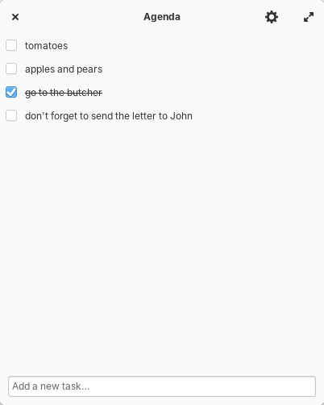
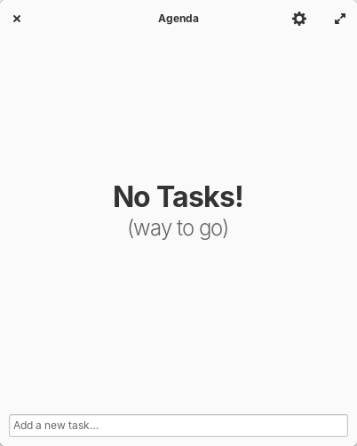

[](https://travis-ci.org/dahenson/agenda)

<p align="center">
  
</p>
<h1 align="center">Agenda</h1>
<p align="center">
  <a href="https://appcenter.elementary.io/com.github.dahenson.agenda"></a>
</p>

|                 |         |
|---------------------------------------------------|---------------------------------------------------|
|  |  |

## A simple, fast, no-nonsense to-do (task) list for elementary OS.

Sometimes, you just need a task list to keep you motivated. Agenda presents you with a quick and easy way to write down your tasks and tick them off as you complete them. The list is saved automatically, so you can close the list to get it out of the way and re-open it for a quick check at any time.

## Made for [elementary OS](https://elementary.io)

Agenda is designed and built for [elementary OS](https://elementary.io), and is available in the AppCenter. Please purchase the application through the AppCenter to ensure that you are using the latest stable build and to recieve updates as soon as they are released. Purchasing through the AppCenter also helps fund further development of this app.

[](https://appcenter.elementary.io/com.github.dahenson.agenda)

## Developing and Building

If you want to hack on Agenda, you'll need the following packages installed:
* libgtk-3-dev
* libgranite-dev
* valac

Then do the `cmake` dance to build and install:

```
mkdir build; cd build
cmake .. -DCMAKE_INSTALL_PREFIX=/usr
make
sudo make install
```

## Other Platforms

Agenda was designed on and built for elementary OS. If you are using this application on another platform, it may have been made available by an interested community member. Unfortunately, I am unable to support other platforms at this time.

If you are running Agenda on something other than elementary OS, please seek support from the community maintainer. Bugs filed against Agenda running on other platforms are of the lowest priority.

## Special Thanks

Huge thanks to [Harvey Cabaguio](https://github.com/harveycabaguio) for the original idea, mockup, and amazing icons. Hire him for something quickly before he becomes too famous!
